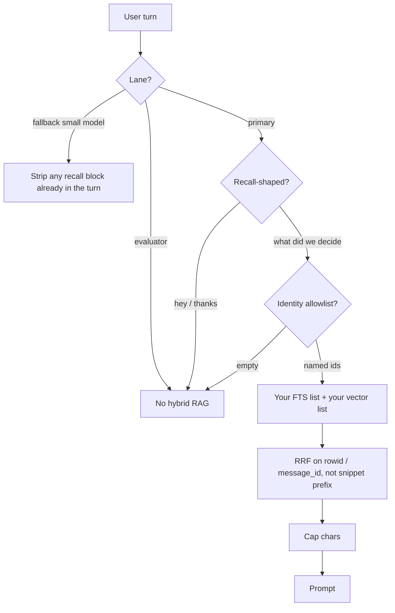

# Gated Recall

**If you only open one file, open [`START_HERE.md`](START_HERE.md).**



Most RAG tutorials embed a corpus, then stuff the top-k snippets into every
prompt. That works in a notebook. It fails on a persistent agent: “hey”
still pays 2k characters; a small-model fallback inherits the large-window
block; a missing user filter returns every tenant; Reciprocal Rank Fusion
keyed on `snippet[:100]` splits one message and merges two.

Gated recall is the **inject policy** in front of whatever store you already
have. Greetings skip. Empty identity lists deny. Hybrid ranks fuse on stable
ids. Fallback **strips** recall that was already baked into the user turn.
The evaluator channel gets no hybrid passages — retrieved text is data, not
a verdict. You still own SQLite, sqlite-vec, FAISS, or CynicVec.

Suggested GitHub / PyPI name: **`gated-recall`**

## Who it helps

| Who | What they get |
| --- | ------------- |
| **You (the technician)** | `build_inject(...)` returns a block or `""`. `""` means do not spend tokens. |
| **AI agents / harnesses** | Most turns pay **0** retrieval tokens. Recall-shaped turns pay a capped block. Fallback pays 0 and drops leftover blocks. |
| **People talking to those agents** | “hey” stays cheap. “what did we decide” still remembers. Guests do not see operator documents. |

## Who should skip this

Teams with huge context and cheap tokens who already like always-on
`similarity_search` in the system prompt. People looking for a vector
*database* — that is sqlite-vec, FAISS, Chroma, or [cynicvec](https://github.com/CynicalTyr/cynicvec)
(ANN **cache** policy). People looking for Mem0’s hosted memory API.
You still write the FTS and/or vector query this kernel calls.

## How it connects to AI agents

| Style | When |
| ----- | ---- |
| **In-process** (recommended) | Call `build_inject` / `prepare_user_turn` inside *your* chat worker. Pass lambdas that hit your DB. |
| **Harness** | Cursor / Claude Desktop / Codex / other IDEs already ReAct. Keep retrieval in the **worker**, not as a chat rule that always pastes memory. |
| **MCP** | This kernel has **no** MCP adapter. Do not invent a `memory_search` tool that bypasses the gate and dumps snippets into the tool trace. Optional inspect: last `RecallMonitor.as_log()` (ids and counts, not snippets). |

Env names (see `.env.example`): `GATED_RECALL_OPERATORS`, `GATED_RECALL_MAX_CHARS`.

## 10-minute first success

```bash
chmod +x scripts/smoke.sh
./scripts/smoke.sh
# optional
python3 -m pip install -e .
python3 examples/quickstart.py
```

Success is `smoke ok` plus printed `greeting inject chars: 0`, a non-zero
recall char count with `msg_ids: [42]`, empty-allowlist skip, and
`fallback stripped recall: True` — **without** embeddings or a GPU.

## Hardware / software

| Resource | Minimum |
| -------- | ------- |
| OS | Linux, macOS, or Windows with Python **3.10+** |
| RAM | Trivial for the library |
| GPU | **None** |
| Network | **None** for first success |

Stdlib only. Wire `hybrid_messages` / `hybrid_documents` to your store.

## Repository layout

| File | What it does | What you change it for |
| ---- | ------------ | ---------------------- |
| `START_HERE.md` | First-use, 10 minutes | You usually do not |
| `README.md` | Product + hidden dynamics | Forks / rename |
| `docs/INTEGRATION.md` | Worker wiring | New host / store |
| `docs/ADVANCED.md` | Always-on RAG vs gated 0-or-capped (search article) | Architecture debates |
| `gated_recall.py` | Gate, allowlist, RRF, strip, lanes, monitor | Keywords / char cap (rarely) |
| `examples/quickstart.py` | Greeting skip + id log + fallback strip | Learning |
| `tests/` | Gate, merge-on-id, guest vs operator docs | Behavior changes |
| `scripts/smoke.sh` | unittest + quickstart | CI locally |
| `.env.example` | Env **names** | Copy to `.env` (never commit `.env`) |

## Related kernels

| Kernel | Why |
| ------ | --- |
| [cynicvec](https://github.com/CynicalTyr/cynicvec) | ANN is a **cache**. This kernel is **when** hits enter the prompt. Pair them; do not merge them. |
| [gated-rewoo](https://github.com/CynicalTyr/gated-rewoo) | Planner skip. Same family: the **gate** is the product. Memory inject is a different gate. |
| [Curiosity-Docker](https://github.com/CynicalTyr/Curiosity-Docker) | Public house style (`START_HERE` as the door). Not a memory store. |
| `pace-lanes` | Primary / fallback / evaluator as a *request* state. Fallback here means strip recall. |
| `agent-review-envelope` | Generator ≠ evaluator. Do not hybrid-RAG the reviewer. |

## What others will discover (that demos hide)

These dynamics show up **after** someone else runs this in a real loop.
Ordinary READMEs skip them; they are why the kernel exists.

| Lens | In this kernel |
| ---- | -------------- |
| **Recurring pattern** | Retrieve **when needed**. Empty identity → no hits. Fuse on ids. Strip on small-model fallback. Evaluator gets lessons as data, not chat RAG. |
| **Feedback loop** | Always-on top-k on every “hey” → token budget and KV cache grow while the user said nothing to recall. Gate → most turns pay 0 retrieval tokens. |
| **Hidden incentive** | Always-inject looks “smarter” in a 3-turn demo. Always-inject is how an 8k emergency model inherits a 2k recall block from the large window. |
| **Leverage point** | `identity_allowlist([])` is deny. RRF key is `rowid`/`message_id`/`chunk_id`. `strip_recall_blocks` on fallback. `Lane.EVALUATOR` returns `""`. |
| **Asymmetry** | Missing ANN can fail-open to FTS (cache). Missing user ids must **never** fail-open to all rows. |
| **Cause → effect** | Primary injects; failover without strip → small model OOMs or hallucinates from leftover hits. Strip → the small model sees the question only. |
| **Opportunity** | Search: *RAG always inject greetings*, *hybrid RRF snippet prefix*, *identity empty filter RAG*. |
| **Risk if copied blindly** | Adding a chat tool that calls your vector DB on every turn “so the model can decide.” That *is* always-on RAG with extra tool tokens. |

**Hidden principle:** retrieved passages are **not** identity and **not** a
review verdict. Per the Cynical0n3 NotebookLM (`systems` + `deep-thought`):
collapsing hot tail, warm retrieve, and cold ledger into one always-inject
window is the token blowout; the writer must not also accept its own review.
A competent engineer still violates this by `similarity_search` in the
system prompt and by pasting the same hits into the evaluator.

**Mental model:** adopters think “RAG *is* memory, so more hits are more
intelligence.” The governing model is **0 or a capped block**, never “top-5
on every turn.” LangChain’s current agent docs persist *thread history*
(`thread_id` + checkpointer) and *summarize* when tokens grow; they do not
strip a recall block on small-model failover. sqlite-vec’s NBC notebook
does RRF in SQL for headlines — it does not decide *whether* those rows
enter an agent prompt. Mem0 filters `user_id` when the caller remembers to
pass it; omitting the filter is not the same as this kernel’s empty-deny.

**Second-order:** once teams copy this, they will optimize “recall hit rate”
and widen the gate until greetings retrieve again. That metric is the
bypass. Count **skip rate** (should be high) and injected chars per turn
(should be ~0 except recall-shaped). Do **not** add `always=True`.

Deeper case studies: [`docs/ADVANCED.md`](docs/ADVANCED.md). Wiring:
[`docs/INTEGRATION.md`](docs/INTEGRATION.md).

## License

MIT. See `LICENSE`.

## Coffee and energy fund

If gated recall saved you a pile of greeting tokens and you want more kernels like it, you can toss something toward CynicalTyr's coffee and energy fund. Optional. Keep shipping either way.

<a title="Donate with PayPal" href="https://www.paypal.me/ctmskm" target="_blank" rel="noopener"></a><a title="Donate with CashApp" href="https://cash.app/$MooseMeNow" target="_blank" rel="noopener"></a> <a title="Donate with Venmo" href="https://venmo.com/MooseMeNow" target="_blank" rel="noopener"></a>
